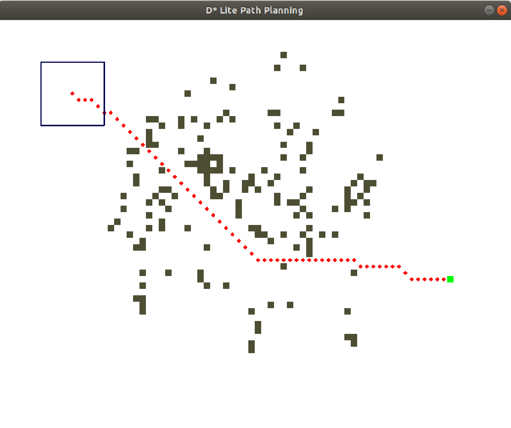

# D* Lite incremental pathplanning algorithm for robotics
Implementation of the D* lite algorithm for pathplanning in Python and eventually c++




This software is an implementation of the D*-Lite algorithm as explained in [Koenig, 2002](http://idm-lab.org/bib/abstracts/papers/aaai02b.pdf). The D* Lite algorithm was developed by Sven Koenig and Maxim Likhachev for a faster more lightweight alternative to the D* algorithm (developed by Anthony Stentz in 1995). 

### idea


The version of D* Lite that I implemented works by bascially running A* search in reverse starting from the goal and attempting to work back to the start. The solver then gives out the current solution and waits for some kind of change in the weights or obstacles that it is presented with. As opposed to repeated A* search, the D* Lite algorithm avoids replanning from scratch and incrementally repair path keeping its modifications local around robot pose.

This is the optimized version as explained in Figure 4 of the paper.

### Main concepts

1. Switched search direction: search from goalto the current vertex. If a change in edge cost is detected during traversal (around the current robot pose), only few nodes near the goal (=start) need to be updated.
2. These nodes are nodes those goal distances have changed or not been caculated before and are relevant to recalculate the new shortest path to the goal.
3. Incremental heuristic search algorithms: able to focus and build upon previous solutions

## Known bugs. Please contribute
After several attempts to both implement the non-optimized and the optimized version of the D* Lite algorithm, I always face the same issue. On some occations the algorithm get stuck in an infinite loop in the 'Procedure Main()' as denoted in the paper or move_and_replan method in code. Now, it seems that from browsing the web that I am not the only one facing this issue. It seems that this is triggered by some obstacle formation (particularly large vertical walls), where the algorithm stops exploring nodes and ends up stuck in an infinite loop jumping between two options for the next best vertex. I have been debugging the code for some time now, but have yet to come up with a fix to this issue. It can however be that I have missinterpreted the pseudo-code for the algorithm somewhere, and I suspect there is a minor detail I have left out. I would kindly take a pull request if someone where to find a fix for this. 

## Implementational Details:
Here is a list of the more interesting tweaks that we applied to improve the D* Lite algorithm explained in [Koenig, 2002].

1. There are two configurations to this implementation. One where you incrementally discover your surroundings by updating the global map (the grid as a whole) with new available information from the local map (only the small square around robot). This is done by setting rescan(..update_globally=False). The other one is where the global map is updated directly from the gui with full observability by setting rescan(... update_globally=True)

## Dependencies
* pip install pygame
* pip install numpy

## install poetry package mananger and virtual env (or use pipenv):
you will need to have the OpenGL/GLUT libraries installed for this to work. But you do not need them to use the Dstar class in your own program.
```
$ pip install poetry
$ cd /d-star-lite/python
$ poetry install
$ poetry shell
$ python main.py
```

### Commands
* [Space] - move robot along line
* [left click] - place obstacle
* [right click] - remove obstacle
* s_start, s_goal and view range can be changed in main.py

### The cell colors are as follows:
* Red - shortest path
* Green - goal vertex
* grey - obstacle
* white - unoccupied


## References:
Improved Fast Replanning for Robot Navigation in Unknown Terrain<br>
Sven Koenig, Maxim Likhachev<br>
Technical Report GIT-COGSCI-2002/3,<br>
Georgia Institute of Technology, 2002.

